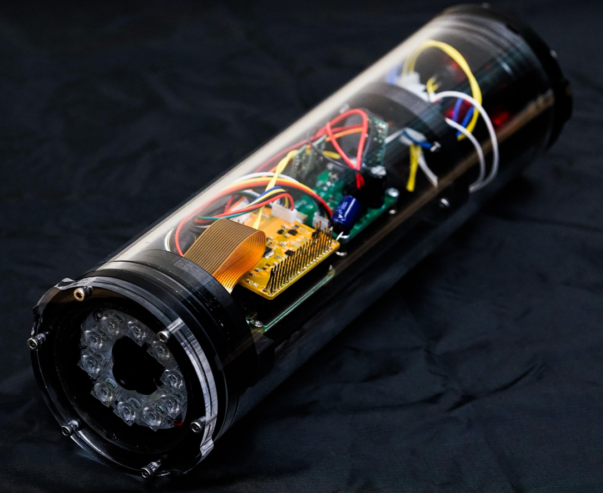

# In Situ Plankton Assemblage eXplorer

This Github repository contains all information necessary to build the In Situ Plankton Assemblage eXplorer (IPAX). Here is a brief introduction to how to utilize the repository. 

# Detailed Guide

A detail building guide is given in the Building Guide subfolder. Note that this guide is written in HTML format. To read it, simply download the entire folder and use a browser to open the file [index.html](https://github.com/plertvilai/IPAX/blob/master/Building%20Guide/index.html "index.html"). 

# Fabrication Files

There are two folders containing files that are necessary for IPAX fabrication.
1. **Mechanicals** contains STL files that can be directly sent to a 3D printer to printout the mechanical parts. A STEP file is also included for users that are interested to develop the system further. The STEP file [Assembly Rev02 Revised for BES v3.step](https://github.com/plertvilai/IPAX/blob/master/Mechanicals/Assembly%20Rev02%20Revised%20for%20BES%20v3.step "Assembly Rev02 Revised for BES v3.step") contains CAD files of all the parts, including waterproof housing from Bluerobotics that can be opened with a CAD software for further development.
2. **PCBs** contains all files for the printed circuit boards in the IPAX. Each subfolder is for each PCB, and the folder fabrication contains Gerber files that can be sent directly to PCB manufacturers. Each subfolder also contains KiCAD files that users can use to develop the PCBs for fit their needs. 

# Firmware
The folder Firmware contains all software for the IPAX. 
### Control Board
This subfolder contains Arduino (.ino) files that can be uploaded to the control board of the IPAX. 
1. full_control_alwaysON is the main routine for the control board that set the Raspberry Pi to always ON.
2. full_control_interval is the main routine for the control board that turns the Raspberry Pi ON only at the specified time.
3. rtc_set is a temporary code that can be uploaded to the control board to set the real-time clock.

### Raspberry Pi
This subfolder contains Python files for the Raspberry Pi on the IPAX. 
1. connectArduino.py is a routine that allows the Raspberry Pi to communicate with the Arduino on the control board.
2. ipaxClass.py is the library for the IPAX.
3. ipaxDeploy.py is the main routine for deploying the IPAX.
4. shutdowncheck.py is the control script that allows the Raspberry Pi to be properly shutdown with an external switch on the housing and the control board.

The configuration subfolder contains all the configuration files needed to configure that Raspberry Pi.

# Bill of Materials
The folder BOM contains a single MS Excel file (.xlsx) that contains the detailed bill of materials of the IPAX. 

